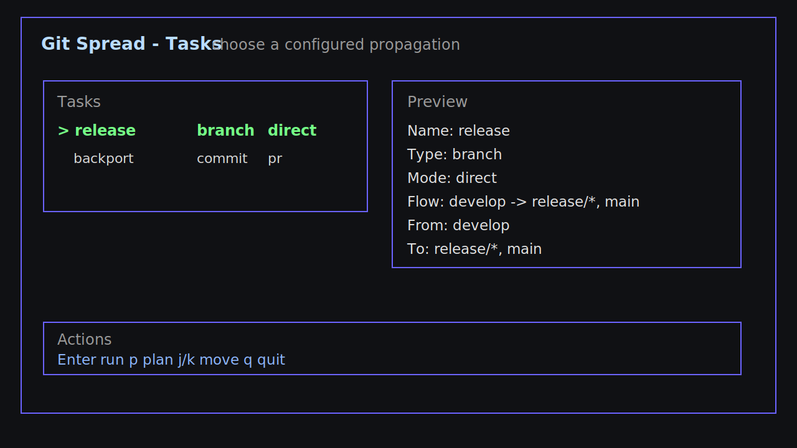
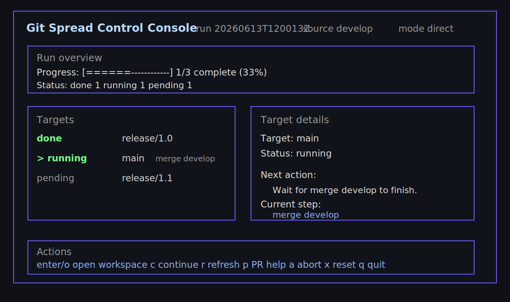
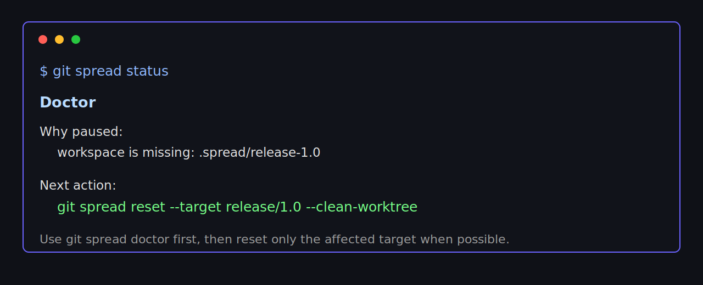

# Git Spread

Git Spread is a local Git workflow tool for propagating the same change across many branches.

Use it when a change lands on `develop` and still needs to reach `release/*`, `main`, or another maintenance branch. It can propagate whole branches, explicit commits, or pull request commits, then pause cleanly when a target needs human attention.

```text
develop
  |
  +--> release/1.0
  +--> release/1.1
  +--> main
```

## Screenshots

Choose a configured propagation task:



Track each target and open the isolated workspace when a target needs action:



Recover from invalid local state without deleting workspaces:



## Why Use It

Git Spread is for teams that repeatedly move changes between long-lived branches:

- Release branch updates: `develop -> release/*, main`
- Backports: `abc123 -> release/1.0, release/1.1`
- Pull request propagation: `PR #123 -> release/*`
- Branch-protected repos where direct push may need to become PR-based work
- Large repositories where switching branches in one working tree is slow or error-prone

It keeps each target in its own isolated workspace under `.spread/`, so your main checkout is not constantly switched between branches.

## Features

- Branch propagation by merge
- Commit propagation by cherry-pick
- Pull request propagation by reading PR commits
- Direct mode for applying and pushing target branches
- PR mode for creating GitHub pull requests
- Target patterns such as `release/*`
- TUI task picker with search, plan confirmation, and active run panel
- Editor handoff for conflicts and local workspace issues
- Run history, rerun-last, retry failed targets, doctor, and safe reset recovery

## Requirements

- Git
- Go 1.26 or newer for building from source
- GitHub authentication for PR mode

The installed binary is `git-spread`. Git also lets you run it as `git spread` when `git-spread` is on your `PATH`.

## Install

Online:

```bash
curl -fsSL https://raw.githubusercontent.com/liyown/git-spread/main/scripts/install.sh | sh
```

Specific version:

```bash
curl -fsSL https://raw.githubusercontent.com/liyown/git-spread/main/scripts/install.sh | VERSION=v0.1.3 sh
```

Offline installers:

| Platform | Artifact |
| --- | --- |
| macOS universal | `git-spread_<version>_darwin_universal.pkg` |
| Debian/Ubuntu x64 | `git-spread_<version>_linux_amd64.deb` |
| Debian/Ubuntu ARM64 | `git-spread_<version>_linux_arm64.deb` |
| Fedora/RHEL x64 | `git-spread_<version>_linux_amd64.rpm` |
| Fedora/RHEL ARM64 | `git-spread_<version>_linux_arm64.rpm` |
| Windows x64 | `git-spread_<version>_windows_amd64.msi` |
| Windows ARM64 | `git-spread_<version>_windows_arm64.msi` |
| Checksums | `checksums.txt` |

Portable executables:

| Platform | Artifact |
| --- | --- |
| macOS universal | `git-spread_<version>_darwin_universal.tar.gz` |
| Linux x64 | `git-spread_<version>_linux_amd64.tar.gz` |
| Linux ARM64 | `git-spread_<version>_linux_arm64.tar.gz` |
| Windows x64 | `git-spread_<version>_windows_amd64.zip` |
| Windows ARM64 | `git-spread_<version>_windows_arm64.zip` |

Release artifacts are built and uploaded by GitHub Actions when pushing a version tag:

```bash
git tag v0.1.0
git push origin v0.1.0
```

Build from source:

```bash
go install ./cmd/git-spread
```

Check the install from any method:

```bash
git spread --version
```

## Quick Start

Create a config:

```bash
git spread init
```

Edit `.git-spread.yml`:

```yaml
version: 1

defaults:
  mode: direct
  remote: origin
  workspace: isolated
  workspaceDir: .spread
  editor: auto
  github:
    collaboration: auto
    forkRemote: fork
    prTitle: "Propagate {source} to {target}"
    prBody: "Created by Git Spread for {target}."
    draft: false
    labels: []
    reviewers: []

tasks:
  release:
    type: branch
    group: release
    description: Move develop into release train branches
    from: develop
    to:
      - release/*
      - main
```

Open the TUI:

```bash
git spread
```

Select `release`, press `Enter`, and Git Spread will apply `develop` to every resolved target.
The TUI first shows a confirmation plan; press `Enter` again to execute, or `Esc` to go back.

## Common Workflows

### Propagate a Branch

Use this when the whole source branch should flow to targets.

```bash
git spread branch develop --to release/1.0,release/1.1,main
```

If the source branch is omitted, Git Spread uses the current branch:

```bash
git spread branch --to release/1.0 --mode pr
```

### Backport Commits

Use this when only specific commits should move.

```bash
git spread commit abc123 def456 --to release/1.0,release/1.1
```

Ranges are supported and expanded in chronological order:

```bash
git spread commit main..feature/login-fix --to release/1.0 --mode pr
```

You can also use a configured task as defaults:

```bash
git spread commit abc123 --task backport
```

Commit tasks usually define targets and mode. The commit SHA or range still comes from the command, so Git Spread does not guess commits from your current branch.

### Propagate a Pull Request

Use this when an existing PR should be backported or replayed into maintenance branches.

```bash
git spread pr 123 --to release/1.0,release/1.1 --mode pr
git spread pr https://github.com/acme/app/pull/123 --to release/*
```

## Direct Mode vs PR Mode

| Mode | What It Does | Best For |
| --- | --- | --- |
| `direct` | Applies changes in each target workspace and pushes the target branch | Repos where you can push release branches |
| `pr` | Creates or pushes a propagation branch, then opens a GitHub PR | Protected branches, review-heavy workflows, fork workflows |

Direct mode is the default:

```bash
git spread branch develop --to release/* --mode direct
```

PR mode:

```bash
git spread commit abc123 --to release/* --mode pr
```

PR titles and bodies can use `{source}`, `{target}`, `{kind}`, and `{mode}` placeholders. Labels and reviewers are applied after the PR is created.

```yaml
defaults:
  github:
    prTitle: "Backport {source} to {target}"
    prBody: "Automated propagation for {target}."
    draft: true
    labels:
      - backport
    reviewers:
      - octocat
```

## History and Retry

List recent runs:

```bash
git spread history
```

Run the most recent configured task again:

```bash
git spread run --last
```

Retry only failed, conflicted, rejected, or blocked targets from the active run or latest history entry:

```bash
git spread retry
```

## Conflict and Recovery Flow

When a target conflicts, Git Spread pauses and records the target state.

```bash
git spread open
```

Resolve the conflict in your editor, commit or complete the merge/cherry-pick if needed, then continue:

```bash
git spread continue
```

If the isolated workspace has unrelated local changes, the TUI shows `needs action`. Open the workspace, commit, stash, or discard those local changes, then continue.

If the run should be abandoned:

```bash
git spread abort
```

If Git Spread itself reports invalid or corrupted local state:

```bash
git spread doctor
git spread reset
```

`reset` only removes `.git/spread/state.json`. It does not delete `.spread/` workspaces and does not discard user changes.

Reset one target and optionally remove its isolated worktree:

```bash
git spread reset --target release/1.0 --clean-worktree
```

## TUI Controls

Task screen:

| Key | Action |
| --- | --- |
| `j` / `k` | Move selection |
| `g` / `G` | Jump to first / last visible task |
| `/` | Search tasks by name, group, description, source, mode, or target |
| `Enter` | Confirm selected task, then run from the confirmation screen |
| `p` | Preview plan |
| `q` | Quit |

Run screen:

| Key | Action |
| --- | --- |
| `Enter` / `o` | Open selected target workspace |
| `c` | Continue current run |
| `r` | Refresh state |
| `p` | Show PR-mode help |
| `a` | Abort active run |
| `x` | Reset Git Spread state |
| `q` | Quit |

## Command Reference

| Command | Purpose |
| --- | --- |
| `git spread` | Open task picker or active run panel |
| `git spread init` | Create `.git-spread.yml` |
| `git spread init --print` | Print config template |
| `git spread run <task>` | Run a configured task |
| `git spread run --last` | Run the most recent configured task from history |
| `git spread plan run <task>` | Preview a configured task |
| `git spread branch [source] --to <targets>` | Propagate a branch |
| `git spread commit <items...> --to <targets>` | Propagate commits or ranges |
| `git spread pr <number-or-url> --to <targets>` | Propagate pull request commits |
| `git spread history` | Show recent run history |
| `git spread retry` | Retry failed targets |
| `git spread doctor` | Diagnose local state and workspaces |
| `git spread examples` | Print common workflows |
| `git spread completion <shell>` | Print shell completion for `bash`, `zsh`, or `fish` |
| `git spread update` | Print the online update command |
| `git spread status` | Show active run state |
| `git spread open` | Open current target workspace |
| `git spread continue` | Continue after conflict or action-needed state |
| `git spread abort` | Abort active run |
| `git spread reset` | Clear invalid Git Spread state only |
| `git spread reset --target <branch> --clean-worktree` | Remove one target from state and delete its isolated worktree |

Automation can disable interactive UI with `--no-tui`:

```bash
git spread branch develop --to release/1.0,main --no-tui
```

## Configuration

Full example:

```yaml
version: 1

defaults:
  mode: direct
  remote: origin
  workspace: isolated
  workspaceDir: .spread
  editor: auto
  github:
    collaboration: auto
    forkRemote: fork
    prTitle: "Propagate {source} to {target}"
    prBody: "Created by Git Spread for {target}."
    draft: false
    labels:
      - propagation
    reviewers: []

tasks:
  release:
    type: branch
    group: release
    description: Move develop into release train branches
    from: develop
    to:
      - release/*
      - main

  backport:
    type: commit
    to:
      - release/*
    mode: pr

  backport-pr:
    type: pr
    to:
      - release/*
    mode: pr
```

Notes:

- `release/*` resolves against repository branches.
- `workspaceDir` defaults to `.spread`.
- `editor: auto` uses the first supported editor command available.
- `github.collaboration: fork` pushes PR heads to your fork remote.
- `commit` and `pr` tasks are commonly used as defaults through `--task`; pass the commit SHA, range, or PR number in the command.

## How It Stores State

Git Spread is local-only.

```text
.git/spread/state.json   active run state
.git/spread/history.jsonl recent run history
.spread/<target>/        isolated target workspace
```

Completed runs clear active state automatically. Paused runs keep state so `continue`, `open`, and the TUI know where to resume.

## Development

Run tests:

```bash
go test ./...
```

Build:

```bash
go build ./cmd/git-spread
```

Design notes live in:

```text
docs/superpowers/specs/2026-06-13-git-spread-design.md
docs/superpowers/plans/2026-06-13-git-spread-v1.md
```
